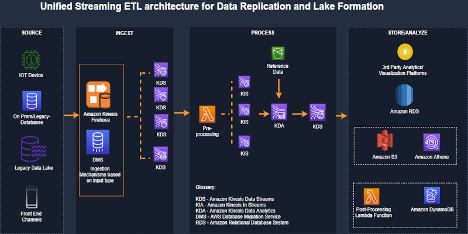
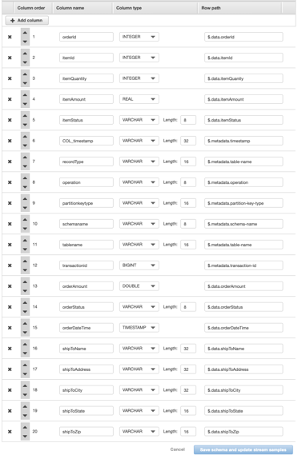
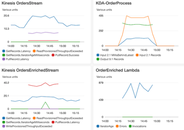

## amazon-unified-streaming-etl

Unified Streaming ETL architecture that bring on-prem data realtime, correlates relational events, creates denormalized/aggregated events and stores results in a DynamoDB. It also forks the incoming event streams to build unified data lake architecture.

## Architecture

## Prerequisites
   1.  An AWS account
   2.  Install Maven 3.x
   3.  Install JDK 1.8+
   4.  AWS CDK 
   5.  MySQL Workbench

## Installation 

### Setting up AWS resources in your account
1.	Setup AWS CDK for Java on your local workstation using instructions from here
2.	Install Maven binaries for Java if you do not have maven installed already.
3.	If this is the first installation of CDK, make sure to run cdk bootstrap.
4.	Clone this repo: https://github.com/rvvittal/amazon-unified-streaming-etl
5.	Navigate to project root folder and run the following commands to build and deploy:
6.	mvn compile  
7.	cdk deploy UnifiedStreamETLCommonStack UnifiedStreamETLDataStack UnifiedStreamETLProcessStack  

### Setup Orders data model for CDC
1.	Navigate to Amazon RDS > Databases, select your database and ensure that you are able to connect to it securely for testing using bastion host or other mechanisms (not detailed in scope of this blog).
2	Start MySQL Workbench, connect to your database using your db endpoint and db creds 
3.	Run orderdb-setup.sql to create data model in your RDS MySQL DB 
4.	Navigate to AWS DMS and test connections to your source and target endpoints
5.	Navigate to DMS > Database migration tasks > your dms task > Table statistics and restart migration task (with full load) for replication to update your table statistics
6.	From MySQL Workbench session, run orders-data-setup.sql to create orders and items
7.	Verify CDC is working as expected by looking at AWS DMS > Database migration tasks > your migration task > Table statistics

### Setup Kinesis Data Analytics Application

   
1.	Upload product reference products.json to your S3 bucket with logical id prefix unifiedBucketId(which was previously created by cdk deploy)
1.	Create a Kinesis Analytics application and map the resources to the data fields as shown.
    1.  To create Kinesis Analytics Stream, navigate to Kinesis->Analytics Application on AWS management console and click create application, selecting SQL as Runtime.
    1.  On next page, connect the streaming data (Kinesis Data Stream) created using CDK->unified order stream. 
    1.  Select Discover Schema and wait for it auto discover schema for input unified order stream. If discovery fails, update records on source RDS tables to send streaming CDC records.  Save and move to next step.
    1.	Connect the reference S3 bucket created using CDK and uploaded with referenced data and input the following: products.json on path to Amazon S3 object; products on In-application reference table name.
    1.	Discover schema and Save/Close
    1.	Click SQL Editor and start KDA application
    1.	Edit Schema for SOURCE_SQL_STREAM_001 and map the data resources as shown in the diagram below
    1.   Click Save schema and update stream samples." Once complete, verify for 1 minute that nothing is the error stream and then go to the next step. If something is in the error stream, check that you defined the schema correctly.
1.  Navigate to Kinesis Analytics Application, select your app > real time analytics > Go to SQL results and run kda-orders-setup.sql to create in-application streams.
1.  From KDA application, Click Connect to destination. For Kinesis data stream select unifiedOrderEnrichedStream  and choose ORDER_ITEM_ENRICHED_STREAM for in-application stream. Click Save and Continue.

 

   
### Testing Unified Streaming ETL Architecture

1.	Navigate to Kinesis Analytics Application, select your app > Real time analytics > Go to SQL results > Real-time analytics and select in-application streams ORDER_ITEM_ENRCIHED_STREAM to see the results of real-time join of records from order and order item streaming kinesis events. 
2.	Navigate to AWS Lambda > search for UnifiedStreamETLProcess > select AWS Lambda function > Monitoring > Recent invocations – and verify AWS Lambda function execution results
3.	Finally, navigate to DynamoDb > OrderEnriched table – and verify the unified and enriched order items records that brings data from order, item and product records together.  

### Operational Aspects

When you are ready to operationalize the above architecture for your workloads, you need to consider several aspects such as:

1.	Monitoring metrics for Kinesis data streams - GetRecords.IteratorAgeMilliseconds, ReadProvisionedThroughputExceeded, WriteProvisionedThroughputExceeded
1.	Monitoring metrics available for AWS Lambda function include but not limited to - Duration, IteratorAge, Error count and success rate (%), Concurrent executions and Throttles
1.	Monitoring metrics for KDA – millisBehindLatest
1.	Monitoring DynamoDB provisioned red and write capacity units 
1.	Using DynamoDB auto scaling feature to automatically manage throughput 

We used the above architecture with the following configuration settings to evaluate the operational performance:

1.	Kinesis OrdersStream with 2 shards, Kinesis OrdersEnrichedStream with 2 shards
1.	AWS Lambda function code does asynchronous processing with kinesis OrdersEnrichedStream records in concurrent batches of 5 with batch size as 500
1.	DynamoDb provisioned WCU is 3000, RCU is 300. 

We observed the following results:

1.	1000K order items are enriched with order event data and product reference data and persisted to DynamoDb
1.	Observed an average of 900 mili-seconds latency from the time of event ingestion to the kinesis pipeline to the time record landed in DynamoDb

 

## Security

See [CONTRIBUTING](CONTRIBUTING.md#security-issue-notifications) for more information.

## License

This library is licensed under the MIT-0 License. See the LICENSE file.

